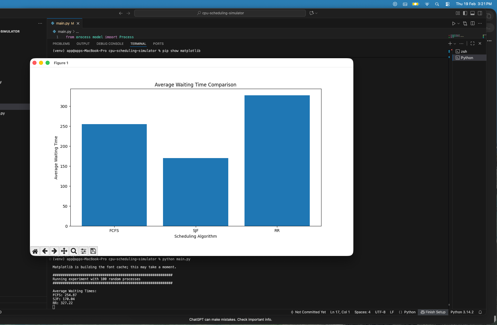
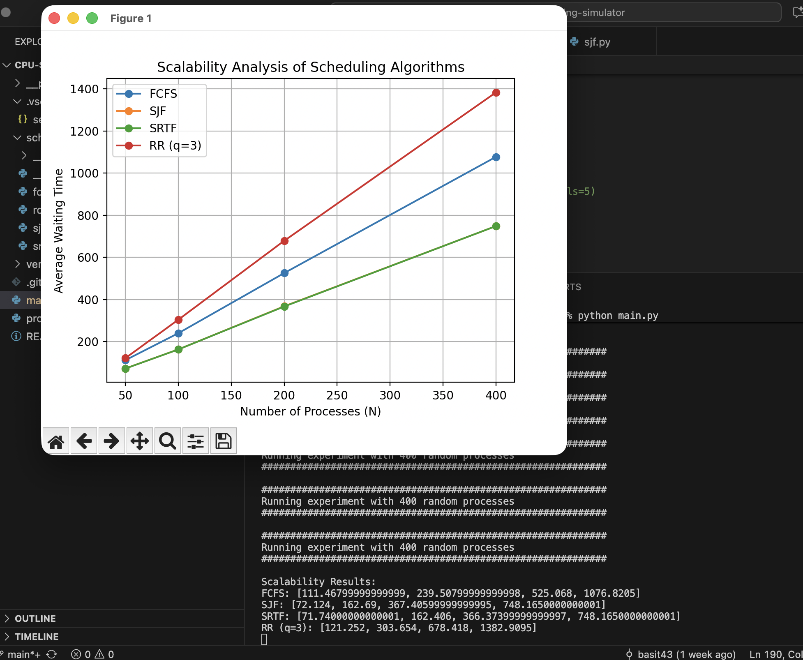
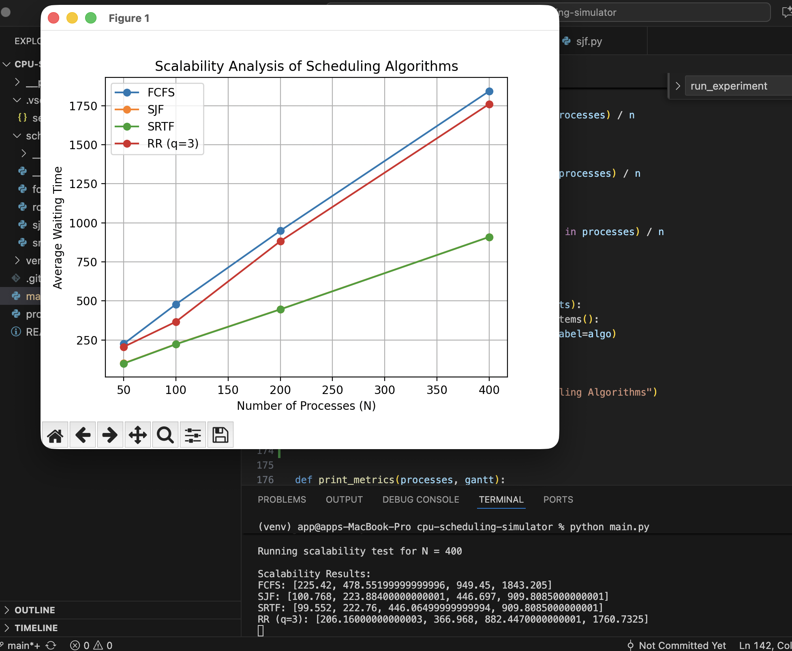

# CPU Scheduling Simulator

Experimental CPU Scheduling Simulator for evaluating classical operating system scheduling algorithms under different workload models.

This project implements multiple scheduling algorithms and evaluates their behavior using **controlled experiments, workload simulations, and scalability analysis**.

The goal is to study how scheduling policies behave as system load increases and how workload distributions influence performance.

---

## Implemented Algorithms

The simulator currently evaluates:

- **FCFS** — First Come First Serve (Non-preemptive)
- **SJF** — Shortest Job First (Non-preemptive)
- **SRTF** — Shortest Remaining Time First (Preemptive)
- **Round Robin** — Time-sliced scheduling

Each algorithm is implemented in a modular architecture and evaluated under identical workloads.

---

## Example Experiment (100 Processes)

The simulator can generate random workloads and compare scheduling algorithms using **average waiting time**.

Observed behavior:

- **SJF / SRTF minimize waiting time**
- **FCFS suffers from convoy effect**
- **Round Robin introduces additional overhead due to time slicing**

---

## Scalability Experiment

To evaluate algorithm scalability, the simulator runs experiments for increasing workload sizes:

N = [50, 100, 200, 400]

The following graph shows how **average waiting time grows as the system load increases**.

Observations:

- Waiting time grows approximately **linearly with workload size**
- **SRTF consistently performs best**
- **Round Robin scales worst due to frequent preemption**

---

## Heavy-Tailed Workload Analysis

Real systems often exhibit **heavy-tailed workloads** where many jobs are small but a few are very large.

To simulate this behavior, burst times are generated using an **exponential distribution**.

Key insights:

- **FCFS degrades significantly due to convoy effect**
- **SRTF benefits from prioritizing short jobs**
- **Round Robin becomes increasingly inefficient at scale**

---

## Experimental Methodology

Each experiment follows a controlled pipeline:

1. Generate synthetic workload of `N` processes
2. Use the **same workload for all algorithms**
3. Run **multiple trials** to reduce randomness
4. Compute average metrics
5. Visualize results using matplotlib

Metrics evaluated:

- Average Waiting Time
- Average Turnaround Time
- Context Switch Count

---

## Project Structure

cpu-scheduling-simulator
│
├── main.py
├── process_model.py
├── schedulers
│ ├── fcfs.py
│ ├── sjf.py
│ ├── srtf.py
│ └── round_robin.py
│
└── README.md

---

## Run the Simulator

Create a virtual environment:

python3 -m venv venv
source venv/bin/activate
pip install -r requirements.txt

Run experiments:

This will generate scheduling experiments and produce the scalability graphs.

---

## Research Motivation

This project explores fundamental questions in operating systems scheduling:

- How do scheduling algorithms behave under increasing load?
- How do **preemptive vs non-preemptive policies** compare?
- How do **heavy-tailed workloads affect scheduling efficiency**?

The simulator serves as a small experimental platform for studying scheduling behavior and system performance.

---

## Future Work

Possible extensions include:

- Context switch overhead modeling
- Starvation and fairness metrics
- Multi-Level Feedback Queue (MLFQ)
- Reinforcement-learning based scheduling policies
- Real workload trace simulation
